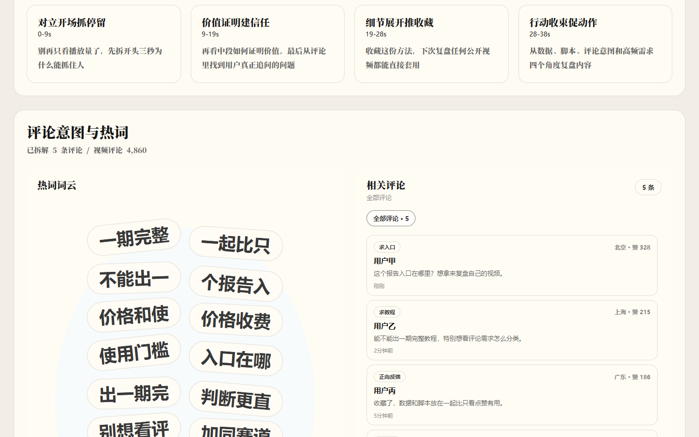

# HotBee Social Data Skills

[](https://github.com/shanye1402-hash/hotbee-social-data-skills/actions/workflows/ci.yml)
[](https://github.com/shanye1402-hash/hotbee-social-data-skills/releases)
[](LICENSE)

Six focused Agent Skills for public social-media data collection, hot rankings, media transcription, and Douyin video reporting through HotBee.

HotBee 社媒数据精选技能包：一个公开仓库、一套安装命令，覆盖六个采集与分析 Skill，不包含图片或视频生成能力。

[HotBee.cn](https://www.hotbee.cn) · [Skills 页面](https://www.hotbee.cn/skills)



## What you get

| Skill | 中文能力 | Verified scope |
| --- | --- | --- |
| `hotbee-douyin-collect` | 抖音数据采集 | 视频、评论、达人、粉丝画像、话题等已确认接口 |
| `hotbee-rednote-collect` | 小红书数据采集 | 公开笔记内容解析 |
| `hotbee-bilibili-collect` | B站数据采集 | 公开视频数据解析 |
| `hotbee-hot-rankings` | 全网热榜 | 小红书、抖音、百度、微博、B站 |
| `hotbee-transcript` | 音视频转文字 | 用户提供的音视频 URL |
| `hotbee-douyin-video-report` | 抖音视频报告 | HTML 报告、评论、转写稿、原始 JSON 和 SVG 报告卡片 |

## Quick start

Install all six skills from this public repository:

```bash
npx -y github:shanye1402-hash/hotbee-social-data-skills#v1.1.0 install
```

Install only one skill:

```bash
npx -y github:shanye1402-hash/hotbee-social-data-skills#v1.1.0 install douyin
npx -y github:shanye1402-hash/hotbee-social-data-skills#v1.1.0 install douyin-video-report
```

Clients that support the Agent Skills CLI can also use:

```bash
npx skills add shanye1402-hash/hotbee-social-data-skills
```

Set the shared credential only in your local environment:

```powershell
[Environment]::SetEnvironmentVariable("HOTBEE_API_KEY", "YOUR_KEY", "User")
```

```bash
export HOTBEE_API_KEY="YOUR_KEY"
```

Preview paid API requests without consuming quota:

```bash
npx -y github:shanye1402-hash/hotbee-social-data-skills#v1.1.0 call douyin --dry-run --text "解析这个视频的播放量和评论 https://v.douyin.com/xxxx/"
npx -y github:shanye1402-hash/hotbee-social-data-skills#v1.1.0 call hot-rankings --dry-run --text "全网热榜"
```

In a compatible Agent Skills client:

```text
使用 $hotbee-douyin-video-report 解析这个抖音视频链接，并生成 HTML 报告、报告图片、评论 CSV/JSON 和视频文案。视频链接：{请粘贴抖音视频链接}
```

From a cloned repository, the video-report script can also run directly:

```bash
python skills/hotbee-douyin-video-report/scripts/douyin_video_report.py --url "抖音视频链接" --output-dir "./output/douyin-video-report"
```

## Example output

The repository includes a synthetic, offline-safe [demo report](examples/douyin-video-report/report.html) and its [sample data](examples/douyin-video-report/README.md). No real username, comment, credential, or API response is included.

```text
douyin-video-report/
├── report.html
├── report-card.svg
├── sample-comments.json
└── sample-transcript.md
```

Regenerate the demo without calling any external API:

```bash
python examples/douyin-video-report/generate_demo.py
```

## Compatibility

- OpenAI Codex and other clients that discover `~/.agents/skills/`
- Claude Code when `~/.claude/` is present or `--claude` is supplied
- Any agent that can read a local `SKILL.md`
- Direct CLI usage with Node.js 18+; the report generator uses Python 3.10+

## Credential and cost boundary

- All six skills use `HOTBEE_API_KEY`. The former `HOTBEE_DOUYIN_KEY` remains a compatibility fallback for the video-report script.
- Start with `--dry-run` and confirm the user's quota/cost intent before a paid live call.
- Never put a key in a prompt, command argument, repository, report, or public issue.
- Only process public links or media the user is authorized to submit. Do not bypass access controls, login gates, rate limits, or paywalls.
- Outputs may contain public usernames, posts, comments, ranking topics, or transcripts. Review applicable laws and platform rules before redistributing them.

## Contributing

Bug reports and narrowly scoped improvements are welcome. Read [CONTRIBUTING.md](CONTRIBUTING.md) before opening a pull request, and use private vulnerability reporting for security issues.

## License

The repository is distributed under [MIT-0](LICENSE). HotBee's hosted API, plans, trademarks, and service terms remain separate.
